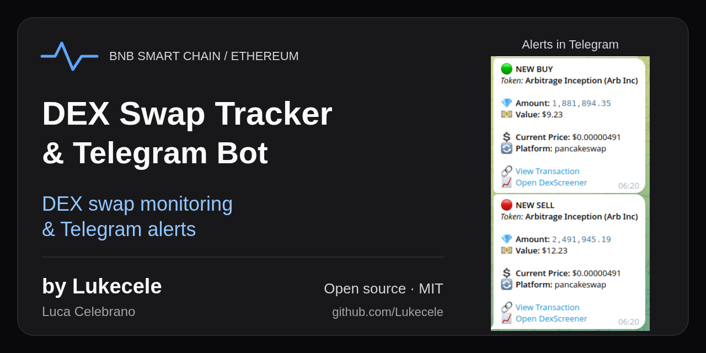
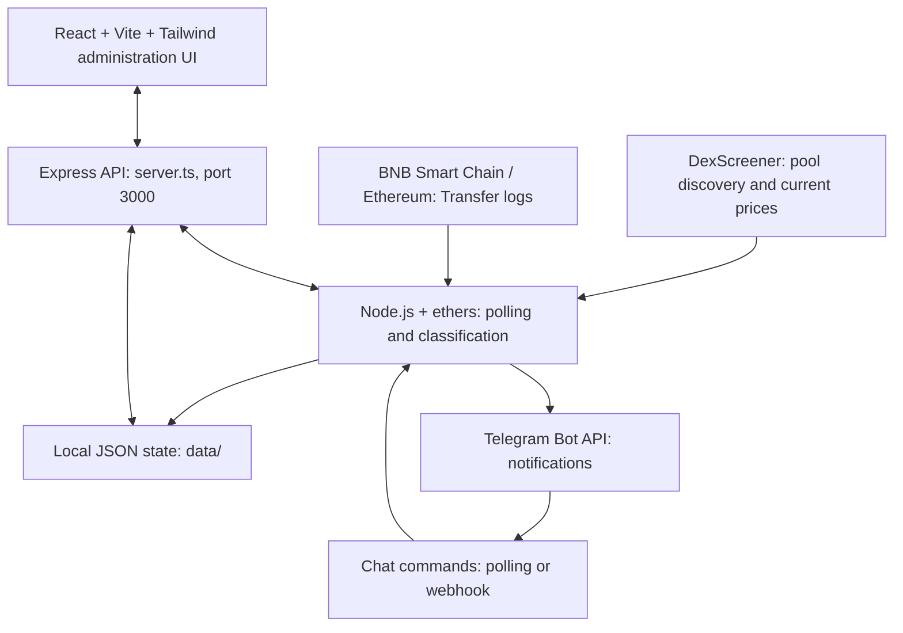

# DEX Swap Tracker & Telegram Bot

**DEX swap monitoring & Telegram alerts — by [Lukecele](https://github.com/Lukecele).**

Track token transfers involving DEX pools on BNB Smart Chain or Ethereum, estimate their USD value, and send buy/sell notifications to Telegram. A React administration dashboard shows worker status, token settings, and recent events. This application monitors activity; it does not execute trades or manage wallets or funds.

[](https://github.com/Lukecele/Telegram-bsc-buy-sell-bot/actions/workflows/ci.yml)
[](LICENSE)

[Open the Telegram bot](https://t.me/ArbincMoon_bot) · [Telegram alerts](#telegram-alerts) · [Run locally](#quick-start) · [Source / Star](https://github.com/Lukecele/Telegram-bsc-buy-sell-bot) · [Follow Lukecele](https://github.com/Lukecele)



## What it does

- Discovers pools and refreshes token prices through DexScreener every minute while monitoring is active.
- Polls EVM `Transfer` logs every five seconds. Transfers from a known pool are classified as buys; transfers to a known pool as sells. This is a heuristic, not full swap decoding.
- Sends English or Italian Telegram alerts with token amount, estimated USD value, price, DEX, and explorer/chart links.
- Provides dashboard controls for monitoring, token address, chain, and language, plus the latest 50 detected events.
- Stores configuration, chat preferences, recent events, and the block cursor in local JSON files under `data/`.

**Current scope:** the RPC implementation supports `bsc` and `ethereum`. Solana appears in some formatting helpers but has no Solana monitoring implementation. The runtime uses DexScreener and public RPCs; no Birdeye or Gemini API key is needed. Values use the latest fetched price, not the historical execution price. Detected events in the dashboard are not proof of successful Telegram delivery.

## Telegram alerts

[Open the bot](https://t.me/ArbincMoon_bot) or [visit the community alert topic](https://t.me/arbitrageinception/80770) to view notifications in Telegram. The [example below](#example-alert) illustrates the alert format.

### Administration dashboard

The dashboard is an **administration panel**, with controls that change server state. This checkout has no authentication layer for those controls. Keep it on a trusted network or behind access control when self-hosting.

There is no verified public, read-only dashboard demo. Both previously advertised web hosts responded on October 1, 2026 and served administration UI bundles; neither is promoted here as a visitor demo. See the [deployment and link audit](docs/project-presentation.md#deployment-and-link-audit).

For the public entry point, [open @ArbincMoon_bot](https://t.me/ArbincMoon_bot). The [community alert topic](https://t.me/arbitrageinception/80770) is also linked by the project; viewing its contents may require Telegram access. The landing pages were checked, but live bot delivery was not tested.

## Example alert

**Synthetic example — illustrative values, not a real transaction or a delivered message.** Explorer and chart labels below represent the links included in actual alerts.

```text
🟢 NEW BUY
Token: Example Token (EXAMPLE)

💎 Amount: 12,500
💵 Value: $250.00
📈 Trend: +1.2% (5m) | +3.4% (1h)
💲 Current Price: $0.02000000
🔄 Platform: pancakeswap

🔗 View Transaction
📈 Open DexScreener
```

## Quick start

Use **Node.js 22+ and npm** (CI uses Node 22; local verification used Node 24). The committed npm lockfile is the dependency source of truth.

```bash
git clone https://github.com/Lukecele/Telegram-bsc-buy-sell-bot.git
cd Telegram-bsc-buy-sell-bot
npm ci
cp .env.example .env
node --env-file=.env --run dev
```

Open [the local dashboard](http://localhost:3000). With the example configuration, the Telegram token is empty and monitoring stays stopped. The server binds to `0.0.0.0:3000`; use a trusted local environment. Stop it with Ctrl+C.

The server reads `process.env` and does **not** automatically load `.env`. The `node --env-file=.env --run dev` command explicitly loads the file before running the package script. You may instead inject variables through your hosting environment.

### Enable notifications on your own instance

Set `TELEGRAM_BOT_TOKEN` in your private `.env`, choose `TOKEN_ADDRESS` and `CHAIN`, then restart with the command above. A non-empty token automatically starts the monitoring worker and Telegram update polling. Never commit your token.

After the first launch, `data/config.json` takes precedence over token address and chain environment defaults. Change the saved settings through your local dashboard. Its language toggle selects English or Italian; the initial language is Italian.

Interact with your own bot in Telegram to register a destination:

| Command | Effect |
| --- | --- |
| `/start` | Subscribe the current chat or topic to alerts. |
| `/stop` | Unsubscribe the current chat or topic. |
| `/lang en` or `/lang it` | Set that chat's language and subscribe it if necessary. |
| `/price` | Show the cached token price. |
| `/chart` | Link to the token on DexScreener. |
| `/ping` | Reply and request a monitoring poll. |

Give the bot permission to post in the intended destination. Notification subscriptions and the global monitoring worker have separate controls.

### Build and run

```bash
npm run lint
npm test
npm run build
NODE_ENV=production node --env-file=.env --run start
```

`npm run build` creates the web assets and `dist/server.cjs`. `npm start` runs the Express server; `NODE_ENV=production` enables serving the built frontend. `npm run preview` only previews Vite assets and does not supply the bot API.

Installation, typecheck, tests, build, and development/production startup were executed locally with the Telegram token empty. Live chain monitoring and Telegram delivery were not exercised.

## Architecture and deployment



The frontend starts at `src/main.tsx`; `server.ts` serves the API and embeds Vite in development. Production uses the same Express process with the built frontend.

The earlier README documented Google Cloud Run hosting; About linked Vercel. This checkout contains **no Dockerfile, Vercel configuration, or Cloud Run deployment workflow**. Hostnames alone do not establish a reproducible deployment. A self-hosted instance needs a continuously running Node process, outbound access to RPC/DexScreener/Telegram, and persistent writable `data/` storage. Keep that directory private: it includes chat identifiers. Multiple instances do not share or coordinate this local state.

With a Telegram token configured, production status requests can register a Telegram webhook using the request hostname. Plan a stable HTTPS hostname and access controls before enabling production notifications. Protect the admin routes and validate webhook traffic; this checkout supplies neither admin authentication nor webhook secret validation.

## Author and contributions

Built by **[Luca Celebrano (@Lukecele)](https://github.com/Lukecele)**, founder and sole member of arbincept.

If this project is useful, [star the repository](https://github.com/Lukecele/Telegram-bsc-buy-sell-bot) and [follow Lukecele](https://github.com/Lukecele) for more projects. See [contributing](CONTRIBUTING.md), [security reporting](SECURITY.md), and the [MIT license](LICENSE).
